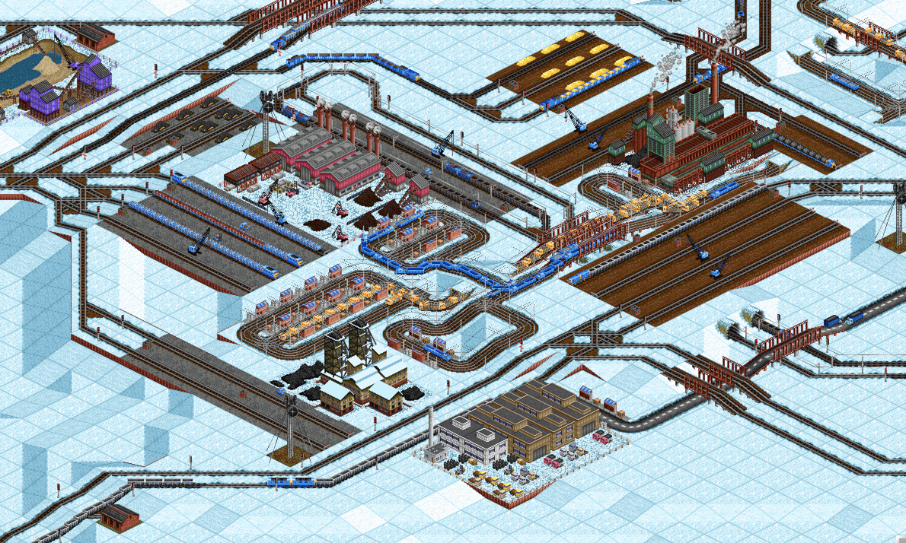
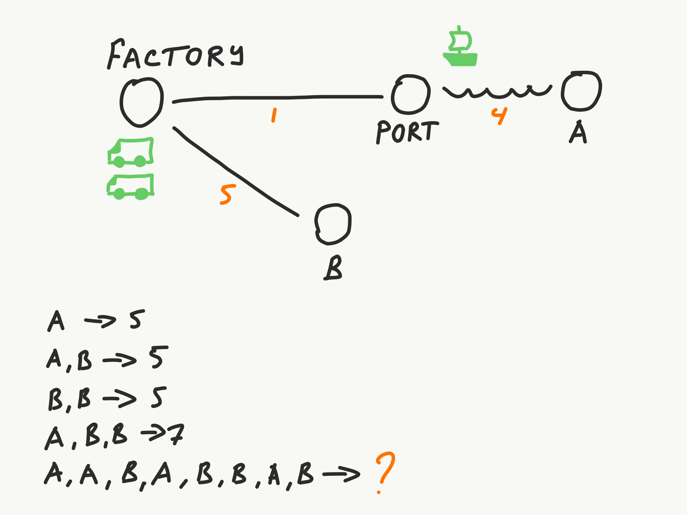

# Transport Tycoon Exercises for DDD

This is a set of Domain-Driven Design (DDD) exercises. They take place in the universe of the [Transport Tycoon](https://en.wikipedia.org/wiki/Transport_Tycoon). It is a game "in which the player acts as an entrepreneur in control of a transport company, and can compete against rival companies to make as much profit as possible by transporting passengers and various goods by road, rail, sea and air."



> Screenshot is from the [OpenTTD showcase](https://www.openttd.org/screenshots.html) (an open source simulation game based upon Transport Tycoon Deluxe).

## Exercise 1

> You can listen to [10-minute introduction by Peter Szarvas and Rinat Abdullin](https://storage.googleapis.com/swp-podcast/ethos/swp-ethos-podcast-01.mp3) or read the summary below.

There is a map containing a Factory, Port, Warehouse A and Warehouse B. Factory has a small stock of containers that have to be delivered to these warehouses.



There are **two trucks and one ship that can carry one container at a time** (trucks start at Factory, ship starts at the Port).

**Traveling takes a specific amount of hours** (represented by an orange number). Time is needed to travel in one direction, you also spend the same amount of time to come back. For example, it takes 5 hours for a truck to travel from the Factory to B.

Transport follows a simple heuristic: **pick the first container from the location** (first-in, first - out), bring it to the designation, then come back home. 

Truck that drops off cargo at the Port doesn't need to wait for the ship (there is a small warehouse buffer there). It can drop the cargo and start heading back.

Transport moves *in parallel*. First truck might be bringing container to a location A, while the second truck comes back from A, while ship travels back to the Port.

### Task

**Task**: write a program that takes a list of cargos from the command line and prints out the number of hours that it would take to get them delivered.

| Input        | Output |
| ------------ | ------ |
| A            | 5      |
| AB           | 5      |
| BB           | 5      |
| ABB          | 7      |
| AABABBAB     | ?      |
| ABBBABAAABBB | ?      |

When done, feel free to add link to your solution to the [solution list](https://github.com/Softwarepark/exercises/blob/master/transport-tycoon/README.md). 

### Exercise Notes

- Don't worry about making the code extensible. We will evolve the codebase, but the deeper domain dive will have to start from the scratch.

- Don't worry if your numbers don't exactly match answers from your colleagues. There is a small loop-hole in the exercise that makes it non-deterministic. We will address it later.

- While picking the language for the exercise, pick whatever that would let you solve the problem quicker. If you are itching to try out a new fancy language that you are less familiar with, there will be a chance for that later.

- Remember that all processes happen in parallel. Trucks and ship would be moving around the map at the same time, not sequentially.

- Don't worry about applying any patterns (e.g. aggregates or events) at this point. Just get the job done. Implementation patterns will emerge in the codebase later.

### Bonus points

1. What is the possible reason for the different solutions to return different answers?
2. Link your solution in the [solution list](https://github.com/Softwarepark/exercises/blob/master/transport-tycoon/README.md).

## Exercise 2

> Audio episode coming November November 19-23

We've got more than 15 solutions at the moment of writing. They are in 9 different languages with completely different implementation styles and architectures. The answers to the problems are also different. 

**That diversity is a good thing**, but it makes difficult to compare the results. It is the time to open up the black-boxes without imposing too much constraints on the implementation details.

Let's modify the solution so that it would log important events in the following format:

- Log entries are in JSON, one JSON object per line

- Optional text comments could start with the #, they are ignored.

We need to **log an entry when the important domain events happen: transport departs and when it arrives**. 

A single line in the log might look like the one below. It is pretty-printed to look nice, normally it would be one line:

```json
{
  "event": "DEPART",     # type of log entry: DEPART of ARRIVE
  "time": 0,             # time in hours
  "transport_id": 0,     # unique transport id
  "kind": "TRUCK",       # transport kind
  "location": "FACTORY", # current location
  "destination": "PORT", # destination (only for DEPART events)
  "cargo": [             # array of cargo being carried
    {
      "cargo_id": 0,     # unique cargo id
      "destination": "A",# where should the cargo be delivered
      "origin": "FACTORY"# where it is originally from
    }
  ]
}
```

Here is an example event log for the entire `AB` delivery:

```textile
# Deliver AB
{"event": "DEPART", "time": 0, "transport_id": 0, "kind": "TRUCK", "location": "FACTORY", "destination": "PORT", "cargo": [{"cargo_id": 0, "destination": "A", "origin": "FACTORY"}]}
{"event": "DEPART", "time": 0, "transport_id": 1, "kind": "TRUCK", "location": "FACTORY", "destination": "B", "cargo": [{"cargo_id": 1, "destination": "B", "origin": "FACTORY"}]}
{"event": "ARRIVE", "time": 1, "transport_id": 0, "kind": "TRUCK", "location": "PORT", "cargo": [{"cargo_id": 0, "destination": "A", "origin": "FACTORY"}]}
{"event": "DEPART", "time": 1, "transport_id": 0, "kind": "TRUCK", "location": "PORT", "destination": "FACTORY"}
{"event": "DEPART", "time": 1, "transport_id": 2, "kind": "SHIP", "location": "PORT", "destination": "A", "cargo": [{"cargo_id": 0, "destination": "A", "origin": "FACTORY"}]}
{"event": "ARRIVE", "time": 2, "transport_id": 0, "kind": "TRUCK", "location": "FACTORY"}
{"event": "ARRIVE", "time": 5, "transport_id": 1, "kind": "TRUCK", "location": "B", "cargo": [{"cargo_id": 1, "destination": "B", "origin": "FACTORY"}]}
{"event": "DEPART", "time": 5, "transport_id": 1, "kind": "TRUCK", "location": "B", "destination": "FACTORY"}
{"event": "ARRIVE", "time": 5, "transport_id": 2, "kind": "SHIP", "location": "A", "cargo": [{"cargo_id": 0, "destination": "A", "origin": "FACTORY"}]}
{"event": "DEPART", "time": 5, "transport_id": 2, "kind": "SHIP", "location": "A", "destination": "PORT"}
```

Given that file, we could do two things with our event logs:

1. Compare the reasoning of our solution to the reasoning from the another solution (even though they could be in different languages).

2. Feed it to the [trace.py](transport-tycoon/trace/) script that will convert this log to Chrome Trace Viewer format file (also JSON, but a different format). That file could be loaded in Chrome to display the outline of our travel.

Here is how the trace for the `AB` delivery might look like:


You can also search for the cargo to highlight the related transport transfers:


### Task

- **Extend your solution** to output domain events.

- Run the domain event log through the [trace.py](transport-tycoon/trace/) converter and then **display in the Chrome Trace tool**. Does the `AABABBAB` solution look right? Does it complete on the hour 29? What aboout `ABBBABAAABBB`?

## Exercise 3

To be announced November 22-24. 

You can subscribe to the [newsletter for the updates](https://tinyletter.com/softwarepark) or just check this repository later.
